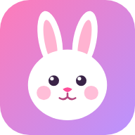
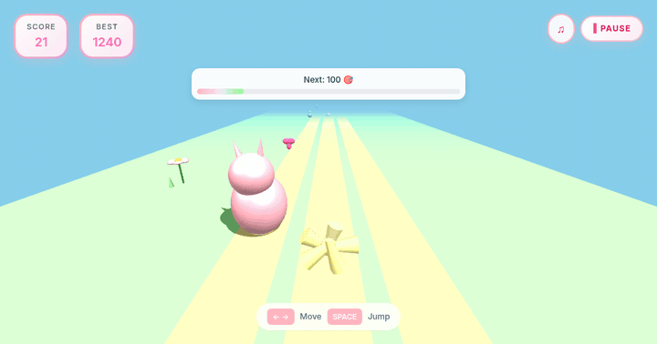
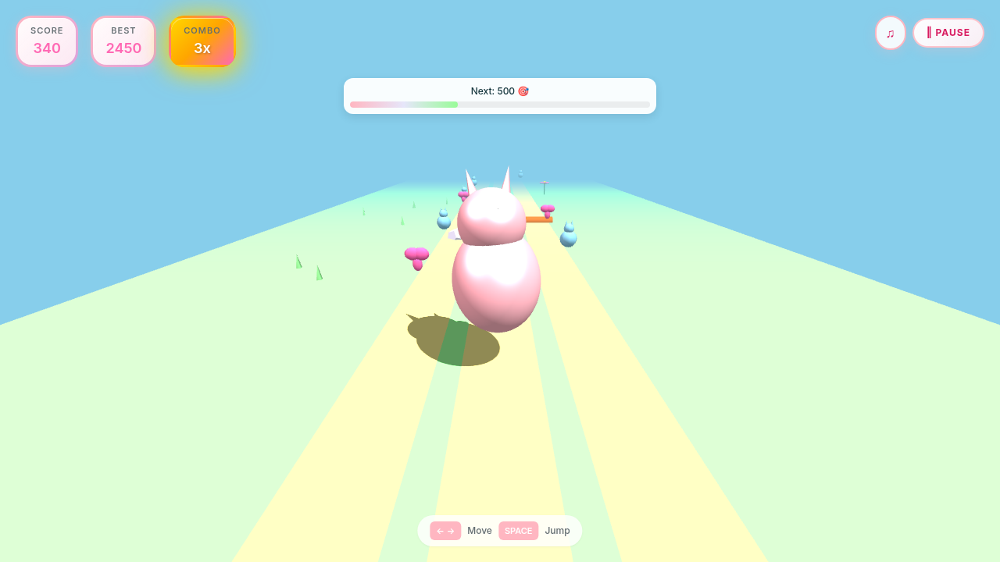
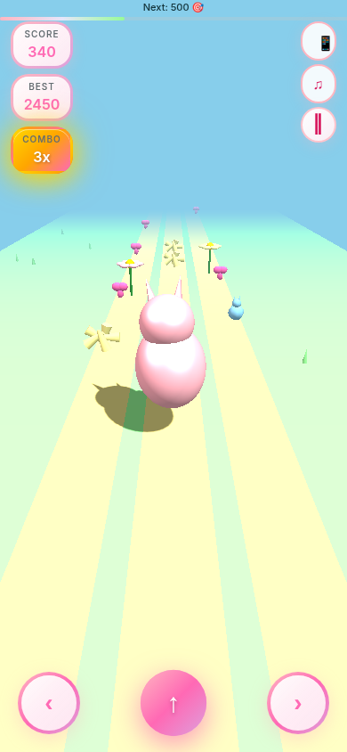
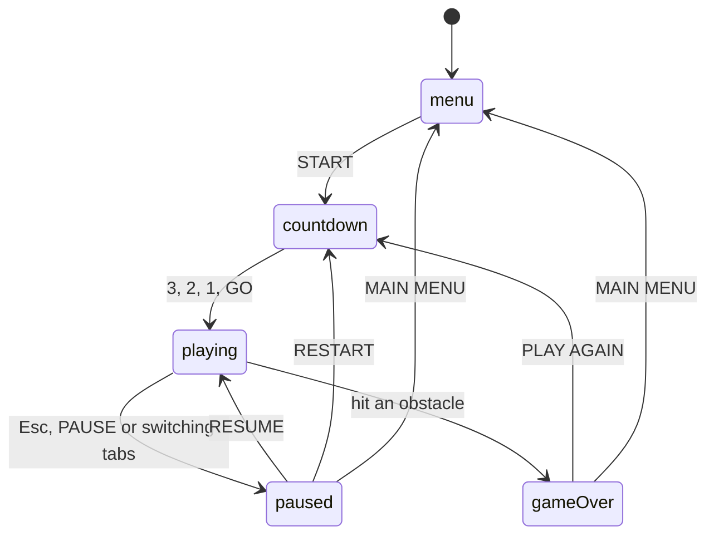

<div align="center">



# Bunny Runner

**A tiny, cute 3D endless runner that runs right in your browser.**<br>Hop between three lanes, jump over flowers, logs and rocks, and snag hearts, stars and bunny plushies for combos.

### [▶ Play it now: bunny.omsingh.me](https://bunny.omsingh.me)

[](https://github.com/omsingh02/bunny/actions/workflows/test.yml) [](LICENSE) [](https://threejs.org)  



[How to play](#-how-to-play) · [Run it](#-run-it-yourself) · [Make it yours](#-make-it-yours) · [How it works](#-how-it-works) · [Tests](#-tests) · [Deploy](#-deploy-your-own)

</div>

---

## ✨ What's inside

- **Three lanes, one jump.** Swipe, tap or use the arrow keys. Lane changes land in about 75 ms and a jump lasts about half a second.
- **Combos.** Grab treats back to back (each within 3 seconds of the last) to build a multiplier of up to **10×**.
- **Three difficulties**, each with its own speed curve and obstacle rhythm.
- **Milestones, achievements and a leaderboard** (top 10 per difficulty). It's all saved in your browser: no accounts, no server.
- **Made for phones too.** On-screen buttons, swipes, taps and vibration feedback. It pauses by itself when you switch apps, and you can install it to your home screen.
- **Everything is procedural.** The bunny, the flowers and the treats are built from Three.js primitives, and every sound effect and the background tune are synthesized with the Web Audio API. There are no model, texture or audio files.
- **Tiny.** The game's own code, styles and page come to about 31 KB gzipped, plus a 40 KB font and Three.js from a CDN.

<p align="center">
  
  &nbsp;&nbsp;
  
</p>

## 🎮 How to play

| | Move | Jump | Pause |
|---|---|---|---|
| ⌨️ **Keyboard** | ← → or A D | Space, ↑ or W | Esc |
| 📱 **Touch** | swipe left / right, or the ‹ › buttons | swipe up, tap anywhere, or the ↑ button | the ‖ button |

Switching to another tab or app pauses the game for you.

**Scoring**

- Distance is worth 10 points per second.
- Every treat is worth 10 points × your combo. The combo counts treats in a row, each within 3 seconds of the last, and the multiplier tops out at 10×.
- Touch any obstacle and the run is over.
- The game speeds up as your score grows, until it reaches the difficulty's top speed.
- Milestones are at 100, 250, 500, 750, 1000, 1500, 2000, 3000, 5000 points. The bar at the top shows how close the next one is.

**Difficulties**

| | Name | Start → top speed | New obstacle every | New treat every | Top speed at about |
|---|---|---|---|---|---|
| 🌸 Easy | Relaxed Garden Stroll | 9 → 16 | 2.0–3.5 s | 0.8–1.5 s | 875 points |
| 💕 Medium | Bunny Hop Fun | 12 → 20 | 1.5–2.8 s | 1.0–2.0 s | 667 points |
| ⚡ Hard | Speedy Meadow Dash | 15 → 26 | 1.0–2.0 s | 1.2–2.2 s | 611 points |

Speeds are world units per second (the lanes are 2 units apart).

**Achievements**

| Achievement | How to get it |
|---|---|
| First Hop! | Jump for the first time |
| Getting Started | Reach 100 points |
| Bunny Master | Reach 500 points |
| Legendary Runner | Reach 1000 points |
| Combo Novice | Get a 5× combo |
| Combo Master | Get a 10× combo |
| Untouchable | Reach 50 points without hitting an obstacle |
| Speed Demon | Reach top speed |

**Settings** (⚙️ in the menu or the pause screen) cover background music, sound effects, vibration, sparkle particles and the keyboard hints. *Reset All Data* wipes your best score, leaderboard, achievements and settings.

## 🚀 Run it yourself

```bash
git clone https://github.com/omsingh02/bunny.git
cd bunny
npm start          # serves the folder at http://localhost:8080
```

- There's nothing to install. `npm start` just runs `python3 -m http.server`, and any static server works (`npx serve`, `php -S localhost:8080`, ...).
- Serve it over `http://`. The game uses ES modules, which browsers won't load from a `file://` page.
- There's no build step and no service worker, so edit a file, refresh, and that's it.
- Three.js is loaded from a CDN, so you need an internet connection (see [limitations](#-limitations)).

## 🎨 Make it yours

| I want to… | Look at |
|---|---|
| Make it easier or harder | `difficultyConfig` in `assets/scripts/game.js`: start and top speed, how fast it ramps up, how often obstacles and treats appear |
| Change how the jump feels | `jumpPower` and `gravity` in `game.js`. A jump lasts `2 × jumpPower / gravity` seconds (about 0.47) and peaks at `jumpPower² / (2 × gravity)` units (about 1.9) |
| Add an obstacle | write a `createSomething()` in `ProceduralModels.js`, then add it to `OBSTACLES` in `WorldManager.js` |
| Add a treat | the same, but add it to `TREATS` in `WorldManager.js` |
| Add a sound | add a few `note()` calls under `SFX` in `AudioSynth.js`, then play it with `audio.play('name')` |
| Add a milestone or an achievement | `milestones`, or `achievements` + `ACHIEVEMENT_RULES` (a one-line test each), in `game.js` |
| Recolor the UI | the custom properties at the top of `assets/styles/game.css` (`--color-pink`, `--color-lavender`, `--color-mint`, `--color-sky`, `--color-primary`, ...) |
| Recolor the 3D world | the hex colors in `ProceduralModels.js`, and the sky and fog in `setupThreeJS` in `game.js` |
| Change the app icon | the drawing in `scripts/make-assets.mjs`, then `npm run assets` |

When you change names, numbers or milestones, update the tables above too. `npm test` checks that this README still matches the game.

Poke at it from the browser console (the game lives at `window.game`):

```js
game.gameOver = () => {}   // an immortal bunny
game.score = 480           // skip ahead
```

## 🧠 How it works

One class, `BunnyRunnerGame`, owns the state. Small modules each do one job.

**Project layout**

```
index.html                      the whole game UI: every screen lives here
assets/scripts/                 game.js and modules/ (below)
assets/styles/game.css          all the styling
assets/fonts/                   self-hosted Inter
assets/icons/                   favicon.svg and the PNG icons (generated)
assets/screenshots/             demo.gif and the install screenshots (generated)
assets/manifest.json            home-screen install info
scripts/make-assets.mjs         generates the icons, preview image and GIF
tests/                          wiring.mjs, smoke.mjs and their helpers
404.html, robots.txt, sitemap.xml, CNAME, .nojekyll    GitHub Pages and SEO basics
favicon.ico, preview.png        generated too
mobile/index.html               redirects old /mobile/ links to the game
```

**Game states**



**Every frame**, the game calls `update()`: spawn things, scroll the world toward the bunny, slide it between lanes, run the jump arc, add score, tick the combo, ramp up the speed, check collisions, move the sparkles. Then it draws, but only while you're playing, or once after something changed. A menu doesn't redraw the scene 60 times a second.

| File (in `assets/scripts/`) | What it does |
|---|---|
| `game.js` | `BunnyRunnerGame`: the state machine, scoring, combos, achievements and the main loop |
| `modules/WorldManager.js` | spawns and scrolls obstacles, treats and scenery, and removes whatever has passed |
| `modules/PhysicsEngine.js` | the jump arc, lane sliding and collision checks |
| `modules/ProceduralModels.js` | every 3D model, built from primitives with shared geometry |
| `modules/ParticleSystem.js` | the sparkle burst when you grab a treat |
| `modules/AudioSynth.js` | sound effects and the background tune, synthesized with Web Audio |
| `modules/InputController.js` | keyboard, touch buttons, swipes and vibration |
| `modules/UIController.js` | screens, HUD, menus and all the DOM wiring |
| `modules/StorageManager.js` | settings, best score, leaderboard and achievements in `localStorage` |
| `modules/AnalyticsManager.js` | a tiny wrapper around the Umami tag |
| `modules/dom.js` | the `$('id')` helper, which throws a clear error if an element is missing |

A few design notes:

- **Frame-rate independent.** Movement, spawn timers, the jump arc and the running bounce all come from elapsed time, and a single step is capped at 50 ms so a lag spike can't teleport the bunny. It plays the same at 60, 120 or 144 Hz. The jump is a plain physics arc (`y = v·t − ½·g·t²`) and lane changes use exponential damping.
- **Cheap to draw.** A frame is roughly 30 draw calls and 7,000 triangles. Obstacles, treats and scenery share one pool of geometries and materials, so spawning one is nearly free and nothing needs disposing.
- **Forgiving on purpose.** Hitboxes are simple distance checks, a little smaller than the models.
- **Sounds are tiny programs.** Each effect is a few oscillator notes (`AudioSynth.js`), and the music is a nine-note tune on a loop. The audio context is created on your first click, as browsers require.

## 🧪 Tests

```bash
npm test
```

- **`tests/wiring.mjs`** runs instantly with no browser. It checks that every element id the JS looks up exists in `index.html`, that every file the pages, manifest and CSS point at exists (icons at the sizes they claim), that the link-preview, canonical and sitemap URLs agree with `CNAME`, that the leaderboard logic holds, and that this README still matches the game and its links work.
- **`tests/smoke.mjs`** plays the real game in headless Chromium: menu, difficulty picker, countdown, keyboard, combos, pause, settings, game over, leaderboard and a reload, then a phone-sized run with real touch events.

The smoke test needs Chrome or Chromium (found automatically; set `CHROME_BIN` if yours lives somewhere unusual) and internet for Three.js. Offline, point it at a local copy: `THREE_JS=/path/to/three.min.js npm test`. GitHub Actions runs `npm test` on every push and pull request.

## 📸 Icons, preview image and screenshots

All the images are generated, so changing the bunny drawing or the look of the game is one command:

```bash
npm run assets               # everything except the GIF
npm run assets icons         # favicons, apple-touch-icon, PWA icons
npm run assets screenshots   # preview.png (link card) + install screenshots
npm run assets demo          # the gameplay GIF above (about 2 minutes)
```

The bunny icon is drawn in `scripts/make-assets.mjs`. The screenshots are real frames of the game, and the GIF is an autopilot playing it with a fixed random seed, so it comes out the same every time. It needs Chrome or Chromium, plus `ffmpeg` for the GIF. `optipng` and `gifsicle` are used if you have them.

## 🌍 Deploy your own

It's all static files, so any static host works. This repo is served by **GitHub Pages** straight from `main`, with a custom domain (`CNAME`) and a `.nojekyll` file.

To run your own copy:

1. Fork the repo and turn on Pages (*Settings → Pages → Deploy from a branch → `main` / root*).
2. Put your domain in `CNAME`, and swap `https://bunny.omsingh.me/` for it in `index.html` (canonical, `og:url`, `og:image`, `twitter:image`), `sitemap.xml` and `robots.txt`. `npm test` fails until they all agree.
3. Remove or replace the Umami `<script>` in `index.html` (it only reports from `bunny.omsingh.me`).

## 🔒 Privacy

The game runs in your browser. Your best score, leaderboard, achievements and settings stay in `localStorage` on your device (keys starting with `bunnyRunner`).

The live site also sends anonymous usage stats to a self-hosted [Umami](https://umami.is) (`a.omsingh.me`): Umami's standard page data plus a few game events (run started or finished with difficulty, score, duration, treats, best combo and platform, new best scores, difficulty changes, and app installs). There are no accounts and no ads. Block that domain if you like; the game doesn't care.

## 🚧 Limitations

- It needs a browser with **WebGL**, ES modules and Web Audio. The automated tests run in Chromium; current Chrome, Edge, Firefox and Safari should all work.
- **Vibration** only works where the Vibration API exists (Android Chrome, but not iOS Safari).
- **No offline mode.** Three.js r128 comes from cdnjs, so the first load needs internet. To self-host it, download `three.min.js` and point the `<script>` tag in `index.html` at your copy.
- Scores live in one browser on one device. There's no sync.

## 🙏 Credits

- [Three.js](https://threejs.org) (MIT) draws everything.
- [Inter](https://rsms.me/inter/) (SIL Open Font License 1.1) is the typeface, self-hosted in `assets/fonts` with its license.
- [Umami](https://umami.is) (MIT) does the analytics.
- The emoji are your system's own.

## 🤝 Contributing

Bug reports, ideas and pull requests are welcome: [open an issue](https://github.com/omsingh02/bunny/issues). The short version is in [CONTRIBUTING.md](CONTRIBUTING.md): run `npm test` before sending a PR, and keep the game **simple, fast and cute** 🐰 (no frameworks, no build tooling).

## 📄 License

[MIT](LICENSE) © 2025–2026 Om Singh
